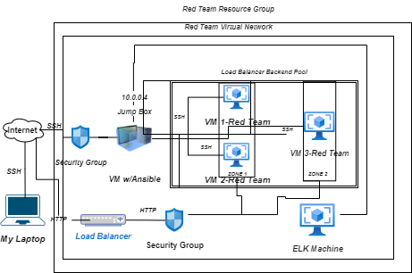
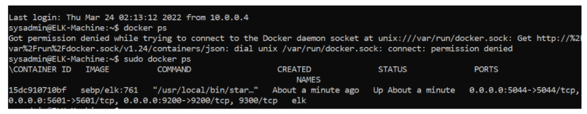

# Scripts
###### Linux and Ansible scripts from my CS class

## Automated ELK Stack Deployment

The files in this repository were used to configure the network depicted below.

These files have been tested and used to generate a live ELK deployment on Azure. They can be used to either recreate the entire deployment pictured above. Alternatively, select portions of the Playbook file may be used to install only certain pieces of it, such as Filebeat.

https://github.com/johannav17/Scripts/blob/main/Ansible/filebeat-playbook.yml
https://github.com/johannav17/Scripts/blob/main/Ansible/metricbeat-playbook.yml

This document contains the following details:
- Description of the Topologu
- Access Policies
- ELK Configuration
  - Beats in Use
  - Machines Being Monitored
- How to Use the Ansible Build

### Description of the Topology

The main purpose of this network is to expose a load-balanced and monitored instance of DVWA, the D*mn Vulnerable Web Application.

Load balancing ensures that the application will be highly available, in addition to restricting access to the network.

- What aspect of security do load balancers protect? Load balancer analyze traffic coming in and determines what server to send the traffic to.
- What is the advantage of a jump box? A jump box limits access that the public has to your virtual network because in order to access the other virtual machines, an individual needs the private IPs of the machines. A jumpbox allows control over access to a virtual network and its contents.

Integrating an ELK server allows users to easily monitor the vulnerable VMs for changes to the log files and system metrics.

- What does Filebeat watch for? Filebeat looks for any changes made to the files and when any are detected, it'll generate and organize the log files. 
- What does Metricbeat record?  Metricbeat records metrics from the Operating system and services running on the server.

The configuration details of each machine may be found below.
_Note: Use the [Markdown Table Generator](http://www.tablesgenerator.com/markdown_tables) to add/remove values from the table_.

| Name                 | Function                   | IP Address | Operating System |
|----------------------|----------------------------|------------|------------------|
| Jump-Box-Provisioner | Gateway                    | 10.0.0.1   | Ubuntu LTS 18.04 |
| Web-1                |   Application Server       | 10.0.0.8   | Ubuntu LTS 18.04 |
| Web 2                |   Application Server       | 10.0.0.9   | Ubuntu LTS 18.04 |
| Elk                  | ELK Stack                  | 10.1.0.4   | Ubuntu LTS 18.04 |

### Access Policies

The machines on the internal network are not exposed to the public Internet. 

Only the Jump-Box machine can accept connections from the Internet. Access to this machine is only allowed from the following IP addresses:
- The public IP address 52.165.4.85.

Machines within the network can only be accessed by the Jump-Box VM.

- Which machine did you allow to access your ELK VM? I accessed the ELK VM with my Jump-Box Virtual Machine.
- What was its IP address? The IP address is 51.13.105.172.

A summary of the access policies in place can be found in the table below.

| Name     | Publicly Accessible | Allowed IP Addresses |
|----------|---------------------|----------------------|
| Jump Box | Yes                 | 52.165.4.85          |
| Web-1 RT | No                  | 10.0.0.4             |
| Web-1 RT | No                  | 10.0.0.4             |
| ELK Mach.| Yes (Port 5601)     | 52.165.4.85          |

### Elk Configuration

Ansible was used to automate configuration of the ELK machine. No configuration was performed manually, which is advantageous because it allows a consistent and predictable configuration. In addition to consistency, with an automated setup, the ELK stack can be created and configured very quickly.

The playbook implements the following tasks:
- The first task of the elk playbook installs docker.io on the Elk virtual machine
- Next we install Python in the ELK VM
- We make sure that there's enough space for ELK since it does require more memory than others
- Next we make sure that docker container is downloaded and running
- Finally we run ELK on the Docker container

The following screenshot displays the result of running `docker ps` after successfully configuring the ELK instance.

### Target Machines & Beats
This ELK server is configured to monitor the following machines:
- Web-1-Red Team 10.0.0.8 and Web-2-Red Team 10.0.0.9
- 
We have installed the following Beats on these machines:
- Filebeat and Metricbeat

These Beats allow us to collect the following information from each machine:
- The Filebeat collects log information about the file system and specifies which files have been changed and modified. This reflects when a file is modified to either Elasticsearch or Logstash.

- Copy the filebeat-config.yml file to /etc/ansible/filebeat-config.yml
- Make the changes needed to the filebeat-config.yml file in the host "10.1.0.4:9200" with username "elastic" and password "changeme" and setup.Kibana host to "10.1.0.4:5601".
- Last we run the playbook, go to the website for Kibana and make sure that once we click the "Check Data" at the bottom of the page reflects that the installation is working successfully.

### Using the Playbook
In order to use the playbook, you will need to have an Ansible control node already configured. Assuming you have such a control node provisioned: 

SSH into the control node and follow the steps below:
- Copy the filebeat-config.yml file to /etc/ansible/files/filebeat-config.yml.
- Update the filebeat-config.yml file to include the host "10.1.0.4:9200" with username "elastic" and password "changeme" and set up the Kibana host to "10.1.0.4:5601".
- Run the playbook, and navigate to Kibana to check that the installation worked as expected.

Answer the following questions to fill in the blanks:_
- Which file is the playbook? Where do you copy it? We have the playbook in the Roles folder we created in the Ansible machine. /etc/ansible/roles/filebeat-playbook.yml.
- Which file do you update to make Ansible run the playbook on a specific machine? How do I specify which machine to install the ELK server on versus which to install Filebeat on? We updated the filebeat-config.yml file in the Ansible folder to make sure we made the right IP adjustments and changes to make sure the ELK server was running. 
- Which URL do you navigate to in order to check that the ELK server is running? The Kibana URL is the one we are utilizing to make sure our ELK servers are up and running. We added all the private IPs to the hosts file to make sure all the connections needed were functioning. http://[your.elk.ip]:5601/app/kibana.
- 
As a **Bonus**, provide the specific commands the user will need to run to download the playbook, update the files, etc.
- $ Command line $ ansible-playbook metricbeat-playbook.yml
- $ Command line $ ansible-playbook filebeat-playbook.yml
